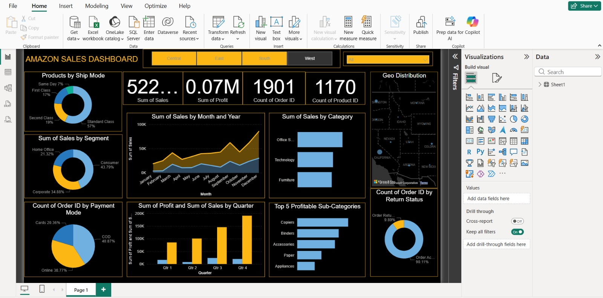

# Amazon Store Sales Analysis – Power BI

## Overview
This project features an interactive Power BI dashboard developed to analyze Amazon store sales data from the United States. The dashboard provides insights into sales performance, profitability, customer segments, and regional trends.

## Dataset Information
- Country: United States
- Region: North America
- Records: 5,900+
- Data includes sales, profit, orders, customers, product categories, and states.

## Key Objectives
- Analyze total sales and profit
- Identify top-performing categories and products
- Perform region-wise and state-level analysis
- Track monthly and quarterly sales trends

## Tools Used
- Power BI
- CSV Dataset
- Data Visualization
- Business Intelligence

## Files Included
- `Amazon_Sales_Dashboard.pbix` – Power BI dashboard file
- `Amazon Store Sales Data.csv` – Dataset
- `Dashboard_Preview.jpeg` – Dashboard screenshot

## Dashboard Preview

## Author
Bathula Shireesha

